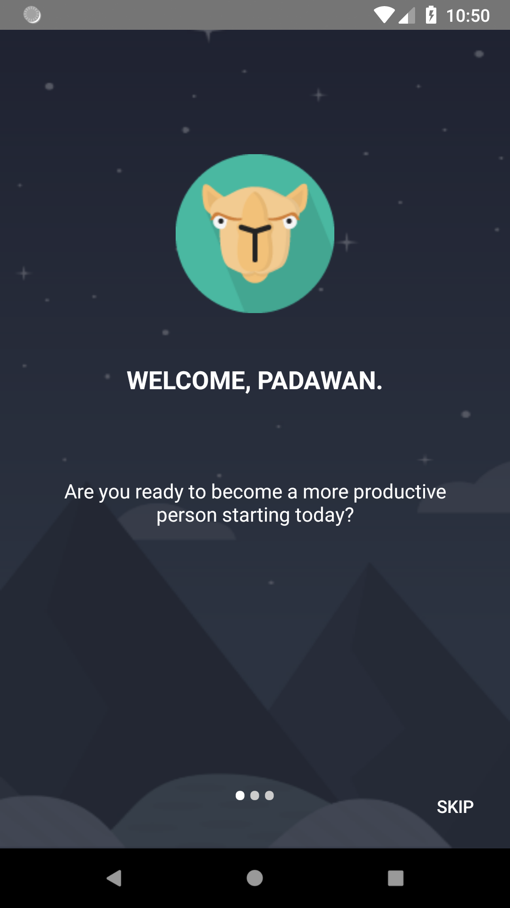
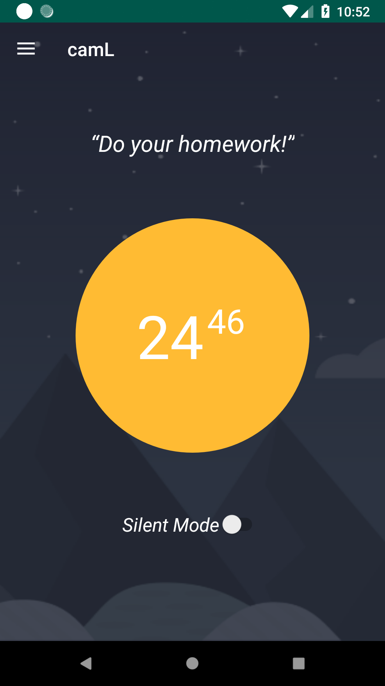
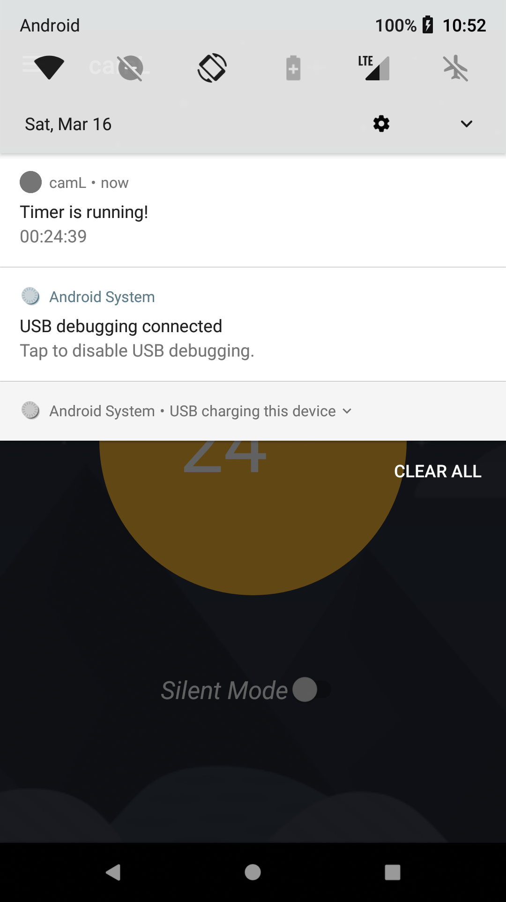
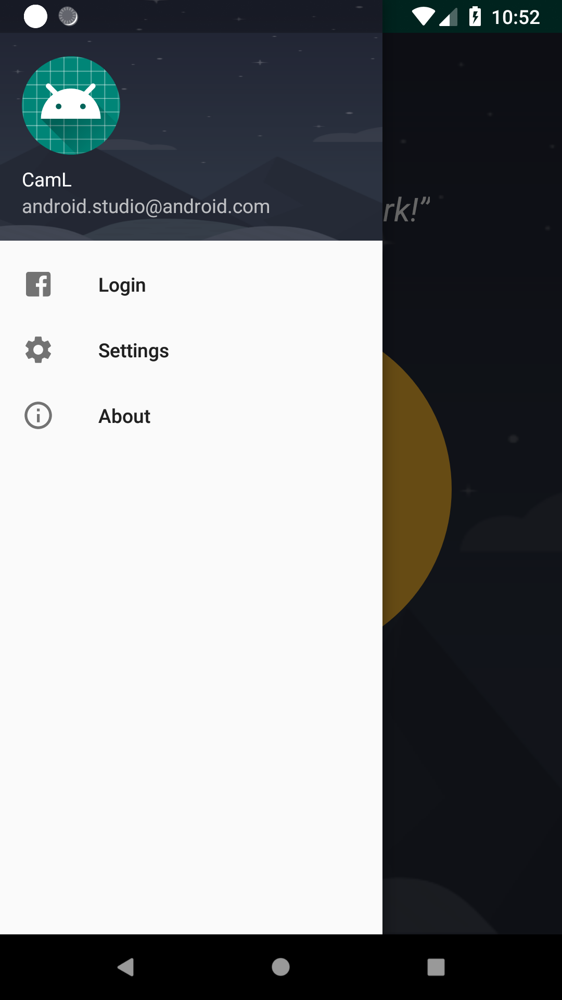
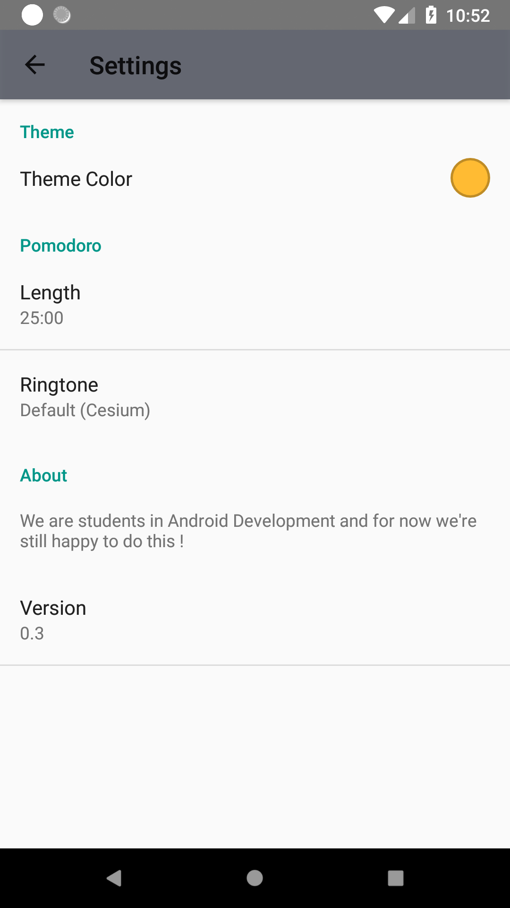

# Pomodoro

## Contexte

Une application réalisée dans le cadre du cours de développement mobile de l'UQAC.

## Contraintes

* L'application devait être ubiquitaire et/ou persuasive
* Elle devait comporter plus de 10 features sans compter les features liées à l'authentification
* L'application devait utiliser Firebase comme base de données
* Au moins un réseau social devait permettre à l'utilisateur de pouvoir se connecter

## Features implémentées

* Splash screen lors du lancement de l'application
* Gestion du compteur de temps
* Notification permettant de retourner dans l'application quand l'utilisateur revient sur la home Android
* Gestion d'une navigation
* Ajout d'un color picker qui change la couleur du compteur situé en homepage
* Connexion avec Facebook
* Création de projets
* Suppression de projet
* Ajouter des todos au projet
* Gestion des cycles
* Gestion de la sonnerie : possibilité de modification en utilisant les sons systèmes
* Silent mode
* Affichage dynamique du menu en fonction du login

## Compabilité et Stack technique

* Développé sur Android Studio
* Nous avons préféré Java à Kotlin
* Versionné avec Git
* Le projet est complètement fonctionnel à partir de l'API 19 d'Android

## Screenshots

